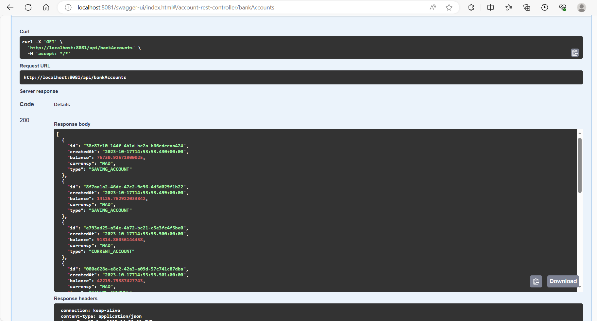

<h5> Micro-service </h5>

<h3>  structure de projet   </h3>

<h3>  test sur postman   </h3>

<h2>  GET : ALL BankAccounts  </h2>

<h2>  GetById   </h2>

<h2>  PUT :  </h2>

<h2>  POST :  </h2>

<h2>  DELETE :  </h2>

<h3>  Documentation SWAGGER :  </h3>

<h2>  GET ALL BankAccounts : </h2>

<h2>  PUT : </h2>

<h2>  GetById :  </h2>

<h2>  POST :  </h2>

<h3>  import /vi/api-docs in postman :  </h3>

<h3>  Spring data-rest :  </h3>

<h3>  alias method & param :  </h3>

<h3>  MAPPERS :  </h3>

